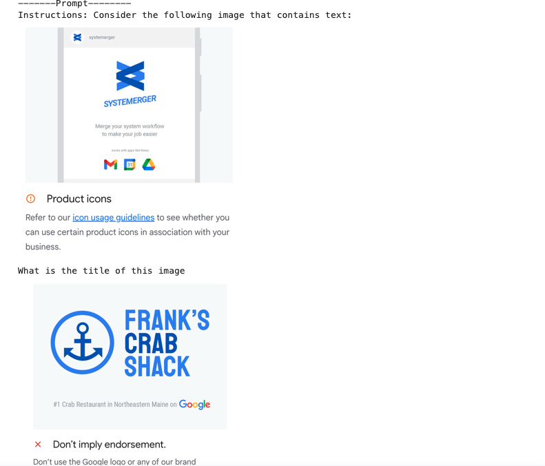
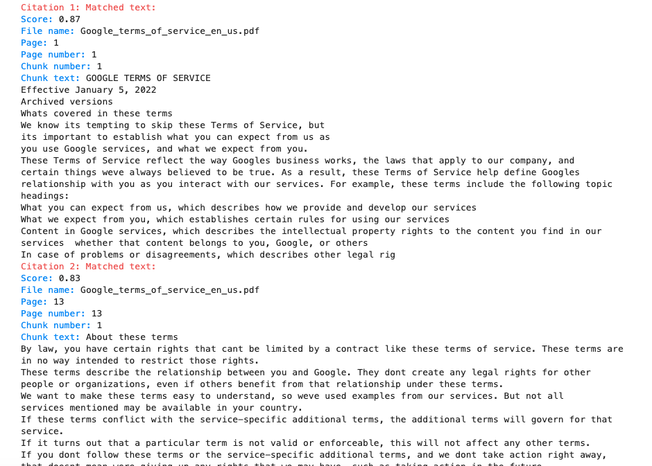

# GCP-Challange-Lab-Inspect-Rich-Documents-with-Gemini-Multimodality-and-Multimodal-RAG
Inspect Rich Documents with Gemini Multimodality and Multimodal RAG: Challenge Lab

### Overview
In a challenge lab you’re given a scenario and a set of tasks. Instead of following step-by-step instructions, you will use the skills learned from the labs in the course to figure out how to complete the tasks on your own! An automated scoring system (shown on this page) will provide feedback on whether you have completed your tasks correctly.

When you take a challenge lab, you will not be taught new Google Cloud concepts. You are expected to extend your learned skills, like changing default values and reading and researching error messages to fix your own mistakes.

To score 100% you must successfully complete all tasks within the time period!

This lab is recommended for students who have enrolled in the Inspect Rich Documents with Gemini Multimodality and Multimodal RAG skill badge. Are you ready for the challenge?

#### Topics tested
Using multimodal prompts to extract information from text and visual data, generating a video description, and retrieving extra information beyond the video by using multimodality with Gemini
Building metadata of documents containing text and images, getting all relevant text chunks, and printing citations by using Multimodal Retrieval Augmented Generation (RAG) with Gemini


Open the notebook in Vertex AI Workbench
In the Google Cloud console, on the Navigation menu (Navigation menu icon), click Vertex AI > Workbench.

Find the generative-ai-jupyterlab instance and click on the Open JupyterLab button.

The JupyterLab interface for your Workbench instance opens in a new browser tab.


Set up the notebook
Click on the inspect_rich_documents_w_gemini_multimodality_and_multimodal_rag-v1.0.0.ipynb file.


In the Select Kernel dialog, choose Python 3 from the list of available kernels.

Run through the 4 cells in the Setup and requirements section of the notebook (before you get to Task 1).

Use the following information to initialize the Vertex AI SDK for Python for your project:

For Project ID, enter qwiklabs-gcp-03-094df4861882
For Location, enter us-east1


Setup and requirements
Install Vertex AI SDK for Python and other dependencies
Run the following four cells below before you get to Task 1. Be sure to add your current project ID to the cell titled Define Google Cloud project information.

```
# "RUN THIS CELL AS IS"

add rich to requirements.txt

change % to ! 
# Install required python packages and other dependencies
!pip3 install --upgrade --user google-cloud-aiplatform
!pip3 install --upgrade --user google-cloud-aiplatform pymupdf
```

Restart current runtime
You must restart the runtime in order to use the newly installed packages in this Jupyter runtime. You can do this by running the cell below, which will restart the current kernel.

```
# "RUN THIS CELL AS IS"

import IPython

# Restart the kernel after libraries are loaded.

app = IPython.Application.instance()
app.kernel.do_shutdown(True)

```

```
# "COMPLETE THE MISSING PART AND RUN THIS CELL"

import sys

# Define project information and update the location if it differs from the one specified in the lab instructions.
PROJECT_ID = "qwiklabs-gcp-03-094df4861882"  # @param {type:"string"}
LOCATION = "us-east1"  # @param {type:"string"}

# Try to get the PROJECT_ID automatically.
if "google.colab" not in sys.modules:
    import subprocess

    PROJECT_ID = subprocess.check_output(
        ["gcloud", "config", "get-value", "project"], text=True
    ).strip()

print(f"Your project ID is: {PROJECT_ID}")

```

Initialize Vertex AI
Initialize the Vertex AI SDK for Python for your project:

```
# "RUN THIS CELL AS IS"

# Initialize Vertex AI.
import vertexai
vertexai.init(project=PROJECT_ID, location=LOCATION)

```


### Task 1. Generate Multimodal Insights with Gemini
In this task, you familiarize yourself with the Google brand and Google brand identity using Gemini, which is a multimodal model that supports multimodal prompts. You include text, image(s), and video in your prompt requests and get text or code responses.

To complete this task, follow the instructions in the notebook.

>Note: Save the notebook script before clicking on the Check my progress button for every task.


Gemini is multimodal model that supports multimodal prompts. You can include text, image(s), and video in your prompt requests and get text or code responses.

To complete Task 1, follow the instructions at the top of each notebook cell:

Run the cells with the comment "RUN THIS CELL AS IS".
Complete and run the cells with the comment "COMPLETE THE MISSING PART AND RUN THIS CELL".
Note: Ensure you can see the weather related data in the response that is printed.

Setup and requirements for Task 1
Import libraries

```
# "RUN THIS CELL AS IS"

from vertexai.generative_models import (
    GenerationConfig,
    GenerativeModel,
    Image,
    Part,
)
```

Load Gemini 2.0 Flash Model

```
# "RUN THIS CELL AS IS"

multimodal_model = GenerativeModel("gemini-2.0-flash-001")
```

Define helper functions


```
# "RUN THIS CELL AS IS"

import http.client
import typing
import urllib.request

import IPython.display
from PIL import Image as PIL_Image
from PIL import ImageOps as PIL_ImageOps


def display_images(
    images: typing.Iterable[Image],
    max_width: int = 600,
    max_height: int = 350,
) -> None:
    for image in images:
        pil_image = typing.cast(PIL_Image.Image, image._pil_image)
        if pil_image.mode != "RGB":
            # RGB is supported by all Jupyter environments (e.g. RGBA is not yet)
            pil_image = pil_image.convert("RGB")
        image_width, image_height = pil_image.size
        if max_width < image_width or max_height < image_height:
            # Resize to display a smaller notebook image
            pil_image = PIL_ImageOps.contain(pil_image, (max_width, max_height))
        IPython.display.display(pil_image)


def get_image_bytes_from_url(image_url: str) -> bytes:
    with urllib.request.urlopen(image_url) as response:
        response = typing.cast(http.client.HTTPResponse, response)
        image_bytes = response.read()
    return image_bytes


def load_image_from_url(image_url: str) -> Image:
    image_bytes = get_image_bytes_from_url(image_url)
    return Image.from_bytes(image_bytes)


def display_content_as_image(content: str | Image | Part) -> bool:
    if not isinstance(content, Image):
        return False
    display_images([content])
    return True


def display_content_as_video(content: str | Image | Part) -> bool:
    if not isinstance(content, Part):
        return False
    part = typing.cast(Part, content)
    file_path = part.file_data.file_uri.removeprefix("gs://")
    video_url = f"https://storage.googleapis.com/{file_path}"
    IPython.display.display(IPython.display.Video(video_url, width=600))
    return True


def print_multimodal_prompt(contents: list[str | Image | Part]):
    """
    Given contents that would be sent to Gemini,
    output the full multimodal prompt for ease of readability.
    """
    for content in contents:
        if display_content_as_image(content):
            continue
        if display_content_as_video(content):
            continue
        print(content)

```


#### Task 1.1 Image understanding across multiple images

``` 
# "RUN THIS CELL AS IS"

# You're going to work with provided variables in this task. 
# First, review and describe the content/purpose of each variable below. 

image_ask_first_1_url = "https://storage.googleapis.com/spls/gsp520/Google_Branding/Ask_first_1.png"
image_dont_do_this_1_url = "https://storage.googleapis.com/spls/gsp520/Google_Branding/Dont_do_this_1.png"
image_ask_first_1 = load_image_from_url(image_ask_first_1_url)
image_dont_do_this_1 = load_image_from_url(image_dont_do_this_1_url)

instructions = "Instructions: Consider the following image that contains text:"
prompt1 = "What is the title of this image"
prompt2 = """
Answer the question through these steps:
Step 1: Identify the title of each image by using the filename of each image.
Step 2: Describe the image.
Step 3: For each image, describe the actions that a user is expected to take.
Step 4: Extract the text from each image as a full sentence.
Step 5: Describe the sentiment for each image with an explanation.

Answer and describe the steps taken:
"""
```

Create an input for the multimodal model


```
# "COMPLETE THE MISSING PART AND RUN THIS CELL"

# Now, you're going to create an input for your multimodal model. Create your contents list using the variables above. Ensure the structure matches the format expected by the multimodal model.


contents = [
    instructions,
    image_ask_first_1,
    prompt1,
    image_dont_do_this_1,
    prompt2,
]

```

Generate responses from the multimodal model

```
responses = multimodal_model.generate_content(contents, stream=True)

```
Display the prompt and responses

```
print("-------Prompt--------")
print_multimodal_prompt(contents)

print("\n-------Response--------")
for response in responses:
    print(response.text, end="")
     
```




To verify your work for Task 1.1, click Check my progress in the lab instructions.


### Task 1.2. Similarities/Differences between images

```
# "RUN THIS CELL AS IS"

# You're going to work with provided variables in this task. First, review and describe the content/purpose of each variable below. 


image_ask_first_3_url = "https://storage.googleapis.com/spls/gsp520/Google_Branding/Ask_first_3.png"
image_dont_do_this_3_url =  "https://storage.googleapis.com/spls/gsp520/Google_Branding/Dont_do_this_3.png"
image_ask_first_3 = load_image_from_url(image_ask_first_3_url)
image_dont_do_this_3 = load_image_from_url(image_dont_do_this_3_url)

prompt1 = """
Consider the following two images:
Image 1:
"""
prompt2 = """
Image 2:
"""
prompt3 = """
1. What is shown in Image 1 and Image 2?
2. What is similar between the two images?
3. What is difference between Image 1 and Image 2 in terms of the text ?
"""


```

Create an input for the multimodal model

```
# "COMPLETE THE MISSING PART AND RUN THIS CELL"

# Now, you're going to create an input for your multimodal model. Create your contents list using the variables above. Ensure the structure matches the format expected by the multimodal model.

contents = [prompt1, image_ask_first_3, prompt2, image_dont_do_this_3, prompt3]
```

Set configuration parameters

```
# "COMPLETE THE MISSING PART AND RUN THIS CELL"

# Now, you're going to set configuration parameters that will influence how the multimodal model generates text. These settings control aspects like the creativity and focus of the responses. Here's how:
# Temperature: Controls randomness. Lower values mean more predictable results, higher values mean more surprising and creative output
# Top p / Top k: Affects how the model chooses words. Explore different values to see how they change the results.
# Other parameters: Check the model's documentation for additional options you might want to adjust.

# Store your configuration parameters in a generation_config variable. This improves reusability, allowing you to easily apply the same settings across tasks and make adjustments as needed.

generation_config = GenerationConfig(
    temperature=0.0,
    top_p=0.8,
    top_k=40,
    candidate_count=1,
    max_output_tokens=2048,
)
```
Generate responses from the multimodal model


```
responses = multimodal_model.generate_content(
    contents,
    generation_config=generation_config,
    stream=True,
)

```
Display the prompt and responses

```

# "COMPLETE THE MISSING PART AND RUN THIS CELL"

# In the last part of this task, you're going to print your contents and responses with the prompt and responses title provided. Use descriptive titles to help organize the output (e.g., "Prompts", "Model Responses") and then display the prompt and responses by using the print() function. 

# Hint: "\n" inserts a newline character for clearer separation between the sections.


print("-------Prompt--------")
print_multimodal_prompt(contents)

print("\n-------Response--------")
for response in responses:
    print(response.text, end="")

```


To verify your work for Task 1.2, click Check my progress in the lab instructions.


### Task 1.3. Generate a video description

```
# "RUN THIS CELL AS IS"

# You're going to work with provided variables in this task. 
# First, review and describe the content/purpose of each variable below. 


prompt = """
What is the product shown in this video?
What specific product features are highlighted in the video?
Where was this video filmed? Which cities around the world could potentially serve as the background in the video?
What is the sentiment of the video?
"""
video = Part.from_uri(
    uri="gs://spls/gsp520/google-pixel-8-pro.mp4",
    mime_type="video/mp4",
)

```

Create an input for the multimodal model

```
# "COMPLETE THE MISSING PART AND RUN THIS CELL"

# Now, you're going to create an input for your multimodal model. Create your contents list using the variables above. Ensure the structure matches the format expected by the multimodal model.

contents = [prompt, video]

```

Generate responses from the multimodal model

```
# "COMPLETE THE MISSING PART AND RUN THIS CELL"

# In the next part of this task, you're going to generate responses from a multimodal model. Capture the output of the model in the "responses" variable by using your "contents" list.


responses = multimodal_model.generate_content(contents, stream=True)
```

Display the prompt and responses
Note: If you encounter any authentication error below cell run, go to the Navigation menu, click Vertex AI > Dashboard, then click "Enable all Recommended APIs" Now, go back to cell 16, and run cells 16, 17 and below cell.

```
# "COMPLETE THE MISSING PART AND RUN THIS CELL"

# In the last part of this task, you're going to print your contents and responses with the prompt and responses title provided. Use descriptive titles to help organize the output (e.g., "Prompts", "Model Responses") and then display the prompt and responses by using the print() function. 

# Hint: "\n" inserts a newline character for clearer separation between the sections.

print("-------Prompt--------")
print_multimodal_prompt(contents)

print("\n-------Response--------")
for response in responses:
    print(response.text, end="")

```


### Task 1.4. Extract tags of objects throughout the video

Explore the variables of the task


```
# "COMPLETE THE MISSING PART AND RUN THIS CELL"

# You're going to work with provided variables in this task. First, review and describe the content/purpose of each variable below. 

prompt = """
Answer the following questions using the video only:
- Which particular sport is highlighted in the video?
- What values or beliefs does the advertisement communicate about the brand?
- What emotions or feelings does the advertisement evoke in the audience?
- Which tags associated with objects featured throughout the video could be extracted?
"""
video = Part.from_uri(
    uri="gs://spls/gsp520/google-pixel-8-pro.mp4",
    mime_type="video/mp4",
)
```

Create an input for the multimodal model

```
# "COMPLETE THE MISSING PART AND RUN THIS CELL"

# Now, you're going to create an input for your multimodal model. Create your contents list using the variables above. Ensure the structure matches the format expected by the multimodal model.

contents = [prompt, video]

```
Generate responses from the multimodal model


```
# "COMPLETE THE MISSING PART AND RUN THIS CELL"

# In the next part of this task, you're going to generate responses from a multimodal model. capture the output of the model in the "responses" variable by using your "contents" list and video input.


responses = multimodal_model.generate_content(contents, stream=True)

```


```
# "COMPLETE THE MISSING PART AND RUN THIS CELL"

# In the last part of this task, you're going to print your contents and responses with the prompt and responses title provided. Use descriptive titles to help organize the output (e.g., "Prompts", "Model Responses") and then display the prompt and responses by using the print() function. 

# Hint: "\n" inserts a newline character for clearer separation between the sections.

print("-------Prompt--------")
print_multimodal_prompt(contents)

print("\n-------Response--------")
for response in responses:
    print(response.text, end="")

```


### Task 1.5. Ask more questions about a video

```
# "COMPLETE THE MISSING PART AND RUN THIS CELL"

# You're going to work with provided variables in this task. 
# First, review and describe the content/purpose of each variable below. 


prompt = """
Answer the following questions using the video only:

How does the advertisement portray the use of technology, specifically AI, in capturing and preserving memories?
What visual cues or storytelling elements contribute to the nostalgic atmosphere of the advertisement?
How does the advertisement depict the role of friendship and social connections in enhancing experiences and creating memories?
Are there any specific features or functionalities of the phone highlighted in the advertisement, besides its AI capabilities?

Provide the answer JSON.
"""
video = Part.from_uri(
    uri="gs://spls/gsp520/google-pixel-8-pro.mp4",
    mime_type="video/mp4",
)


```
Create an input for the multimodal model

```
# "COMPLETE THE MISSING PART AND RUN THIS CELL"

# Now, you're going to create an input for your multimodal model. Create your contents list using the variables above. Ensure the structure matches the format expected by the multimodal model.

contents = [prompt, video]

```

Generate responses from the multimodal model


```
responses = multimodal_model.generate_content(contents, stream=True)

```

Display the prompt and responses


```
# "COMPLETE THE MISSING PART AND RUN THIS CELL"

# In the last part of this task, you're going to print your contents and responses with the prompt and responses title provided. Use descriptive titles to help organize the output (e.g., "Prompts", "Model Responses") and then display the prompt and responses by using the print() function. 

# Hint: "\n" inserts a newline character for clearer separation between the sections.


print("-------Prompt--------")
print_multimodal_prompt(contents)

print("\n-------Response--------")
for response in responses:
    print(response.text, end="")

```


### Task 1.6. Retrieve extra information beyond the video 

Explore the variables of the task

```
# "COMPLETE THE MISSING PART AND RUN THIS CELL"

# You're going to work with provided variables in this task. 
# First, review and describe the content/purpose of each variable below. 


prompt = """
Answer the following questions using the video only:

How does the advertisement appeal to its target audience through its messaging and imagery?
What overall message or takeaway does the advertisement convey about the brand and its products?
Are there any symbolic elements or motifs used throughout the advertisement to reinforce its central themes?
What is the best hashtag for this video based on the description ?

"""
video = Part.from_uri(
    uri="gs://spls/gsp520/google-pixel-8-pro.mp4",
    mime_type="video/mp4",)
```

Create an input for the multimodal model

```
# "COMPLETE THE MISSING PART AND RUN THIS CELL"

# Now, you're going to create an input for your multimodal model. Create your contents list using the variables above. Ensure the structure matches the format expected by the multimodal model.

contents = [prompt, video]

```

Generate responses from the multimodal model

```
# "COMPLETE THE MISSING PART AND RUN THIS CELL"

# In the next part of this task, you're going to generate responses from a multimodal model. capture the output of the model in the "responses" variable by using your "contents" list and video input.

responses = multimodal_model.generate_content(contents, stream=True)

```

Display the prompt and responses

```
# "COMPLETE THE MISSING PART AND RUN THIS CELL"

# In the last part of this task, you're going to print your contents and responses with the prompt and responses title provided. Use descriptive titles to help organize the output (e.g., "Prompts", "Model Responses") and then display the prompt and responses by using the print() function. 

# Hint: "\n" inserts a newline character for clearer separation between the sections.


print("-------Prompt--------")
print_multimodal_prompt(contents)

print("\n-------Response--------")
for response in responses:
    print(response.text, end="")

```


To verify your work for Task 1.6, click Check my progress in the lab instructions.


### Task 2. Retrieve and integrate knowledge with multimodal retrieval augmented generation (RAG)
To complete Task 2, follow the instructions at the top of each notebook cell:

Run the cells with the comment "RUN THIS CELL AS IS".
Complete and run the cells with the comment "COMPLETE THE MISSING PART AND RUN THIS CELL".
For additional information about the available data and helper functions for Task 2, review the section named Available data and helper functions for Task 2 in the lab instructions.

Setup and requirements for Task 2
Import libraries¶

```
# "RUN THIS CELL AS IS"

# Import necessary packages and libraries.

from IPython.display import Markdown, display
from vertexai.generative_models import (
    Content,
    GenerationConfig,
    GenerationResponse,
    GenerativeModel,
    HarmCategory,
    HarmBlockThreshold,
    Image,
    Part,
)

```

Load the Gemini 2.0 Flash model


```
# "RUN THIS CELL AS IS"

# Load the Gemini 2.0 Flash model.

multimodal_model = GenerativeModel("gemini-2.0-flash-001")
```

Download custom Python modules and utilities
The cell below will download some helper functions needed for this notebook, to improve readability. You can also view the code (intro_multimodal_rag_utils.py) directly on GitHub.


```
# "RUN THIS CELL AS IS"

# Import necessary packages and libraries.
import os
import urllib.request
import sys

if not os.path.exists("utils"):
    os.makedirs("utils")


# Download the helper scripts from utils folder.
url_prefix = "https://raw.githubusercontent.com/GoogleCloudPlatform/generative-ai/main/gemini/use-cases/retrieval-augmented-generation/utils/"
files = ["intro_multimodal_rag_utils.py"]

for fname in files:
    urllib.request.urlretrieve(f"{url_prefix}/{fname}", filename=f"utils/{fname}")
```

Get documents and images from Cloud Storage


```
# "RUN THIS CELL AS IS"

# Download documents and images used in this notebook.

!gsutil -m rsync -r gs://spls/gsp520 .
print("Download completed")
```


#### Available data and helper functions for Task 2
For this task, you use two different source data documents:

1. The Terms of Service document for Google's services, defining the relationship between Google and its users. It covers what users can expect from Google, the rules for using the services, intellectual property rights related to content, and the procedures for resolving disputes or disagreements. This sample document contains only text.

2. A modified version of Google-10K which provides a comprehensive overview of the company's financial performance, business operations, management, and risk factors. As the original document is rather large, you will be using a modified version with only 14 pages, split into two parts - Part 1 and Part 2 instead. Although it's truncated, this sample document still contains text along with images such as tables, charts, and graphs.

You also select from the following helper functions to complete the tasks (more information on these functions available on GitHub):

- For Inspect the processed text metadata:

text: the original text from the page
text_embedding_page: the embedding of the original text from the page
chunk_text: the original text divided into smaller chunks
chunk_number: the index of each text chunk
text_embedding_chunk: the embedding of each text chunk


- For Inspect the processed image metadata:

img_desc: Gemini-generated textual description of the image.
mm_embedding_from_text_desc_and_img: Combined embedding of image and its description, capturing both visual and textual information.
mm_embedding_from_img_only: Image embedding without description, for comparison with description-based analysis.
text_embedding_from_image_description: Separate text embedding of the generated description, enabling textual analysis and comparison.


- For Import the helper functions to implement RAG:

get_similar_text_from_query(): Given a text query, finds text from the document which are relevant, using cosine similarity algorithm. It uses text embeddings from the metadata to compute and the results can be filtered by top score, page/chunk number, or embedding size.
print_text_to_text_citation(): Prints the source (citation) and details of the retrieved text from the get_similar_text_from_query() function.
get_similar_image_from_query(): Given an image path or an image, finds images from the document which are relevant. It uses image embeddings from the metadata.
print_text_to_image_citation(): Prints the source (citation) and the details of retrieved images from the `get_similar_image_from_query()`` function.
get_gemini_response(): Interacts with a Gemini model to answer questions based on a combination of text and image inputs.
display_images(): Displays a series of images provided as paths or PIL Image objects.


#### Task 2.1. Build metadata of documents containing text and images

Import helper functions to build metadata

```
# "RUN THIS CELL AS IS"

# Import helper functions from utils.
from utils.intro_multimodal_rag_utils import get_document_metadata

```

Explore the variables of the task


```
# "RUN THIS CELL AS IS"

# You're going to work with provided variables in this task. 
# First, review and describe the content/purpose of each variable below. 


# Specify the "PDF folder path" with single PDF and "PDF folder" with multiple PDF.

pdf_folder_path = "Google_Branding/"  # if running in Vertex AI Workbench.

# Specify the image description prompt. Change it
image_description_prompt = """Explain what is going on in the image.
If it's a table, extract all elements of the table.
If it's a graph, explain the findings in the graph.
Do not include any numbers that are not mentioned in the image.
"""

```


Extract and store metadata of text and images from a document


```
# "COMPLETE THE MISSING PART AND RUN THIS CELL"

# Call the "get_document_metadata" function from the utils file to extract text and image metadata from the PDF document. Store the results in two different DataFrames: "text_metadata_df" and "image_metadata_df".  
# text_metadata_df: This will contain extracted text snippets, their corresponding page numbers, and potentially other relevant information.
# image_metadata_df: This will contain descriptions of the images found in the PDF (if any), along with their location within the document.


# Extract text and image metadata from the PDF document
text_metadata_df, image_metadata_df = get_document_metadata(
    multimodal_model,  # we are passing Gemini 2.0 Flash model
    pdf_folder_path,
    image_save_dir="images",
    image_description_prompt=image_description_prompt,
    embedding_size=1408,
    add_sleep_after_page = True,
    sleep_time_after_page = 5,
    # generation_config = # see next cell
    # safety_settings =  # see next cell
)

print("\n\n --- Completed processing. ---")

```


Inspect the processed text metadata

```
# "COMPLETE THE MISSING PART AND RUN THIS CELL"

# Explore the text_metadata_df dataframe by displaying the first few rows of the dataframe.

text_metadata_df.head()

#image_metadata_df.head()
```


Import the helper functions to implement RAG

```
from utils.intro_multimodal_rag_utils import (
    display_images,
    get_gemini_response,
    get_similar_image_from_query,
    get_similar_text_from_query,
    print_text_to_image_citation,
    print_text_to_text_citation,
)
```

#### Task 2.2. Create a user query

Explore the variables of the task

```
# "RUN THIS CELL AS IS"

# You're going to work with provided variables in this task. 
# First, review and describe the content/purpose of each variable below. 

query = """Questions:
 - What are the key expectations that users can have from Google regarding the provision and development of its services?
- What specific rules and guidelines are established for users when using Google services?
- How does Google handle intellectual property rights related to the content found within its services, including content owned by users, Google, and third parties? 
- What legal rights and remedies are available to users in case of problems or disagreements with Google?
- How do the service-specific additional terms interact with these general Terms of Service, and which terms take precedence in case of any conflicts?
 """

```

#### Task 2.3. Get all relevant text chunks
Retrieve relevant chunks of text based on the query

```
# Retrieve relevant chunks of text based on the query
matching_results_chunks_data = get_similar_text_from_query(
    query,
    text_metadata_df,
    column_name="text_embedding_chunk",
    top_n=10,
    chunk_text=True,
)
```

Display the first item of the text chunk dictionary

```
print_text_to_text_citation(
    matching_results_chunks_data,
    print_top=False,
    chunk_text=True,
)

```



#### Task 2.4. Create context_text

Create a list to store the combined chunks of text

```
# combine all the selected relevant text chunks
context_text = []

```
Iterate through each item in the text chunks dictionary¶

```
# "COMPLETE THE MISSING PART AND RUN THIS CELL"

# Create a for loop to iterate through each item in the matching_results_chunks_data dictionary in order to combine all the selected relevant text chunks

for key, value in matching_results_chunks_data.items():
    context_text.append(value["chunk_text"])

```
Join all the text chunks and store in a list

```
# "COMPLETE THE MISSING PART AND RUN THIS CELL"

# Take all of the individual text chunks stored in the context_text list and join them together into a single string named final_context_text. Use "\n" part inserts a newline character between each chunk, effectively creating separate lines or paragraphs.

final_context_text = "\n".join(context_text)
```


#### Task 2.5. Pass context to Gemini


Explore the variables of the task

```
# "RUN THIS CELL AS IS"

# You're going to work with provided variables in this task. First, review and describe the content/purpose of each variable below. 

prompt = f""" Instructions: Compare the images and the text provided as Context: to answer multiple Question:
Make sure to think thoroughly before answering the question and put the necessary steps to arrive at the answer in bullet points for easy explainability.
If unsure, respond, "Not enough context to answer".

Context:
 - Text Context:
 {final_context_text}


{query}

Answer:
"""
```

Generate Gemini response with streaming output

```
# "COMPLETE THE MISSING PART AND RUN THIS CELL"

# Call "get_gemini_response" function from utils module in order to generate Gemini response with streaming output. This function uses a multimodal Gemini model, a text prompt, and configuration parameters and instructs the Gemini model to generate a response using the provided prompt. As Gemini model enables streaming, you will receive chunks of the response as they were produced. 
# Format the streamed output using Markdown syntax for easy readability and conversion to HTML.

Markdown(
    get_gemini_response(
        multimodal_model,
        model_input=[prompt],
        stream=True,
        generation_config=GenerationConfig(temperature=1),
    )
)
```

